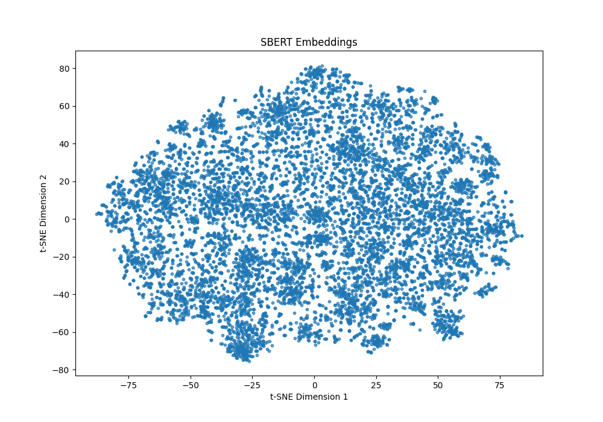
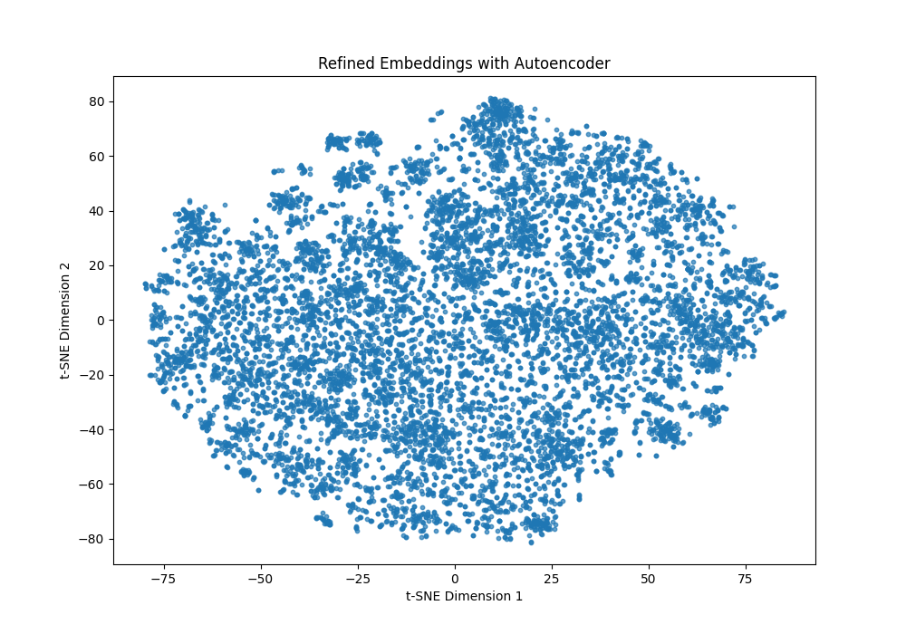
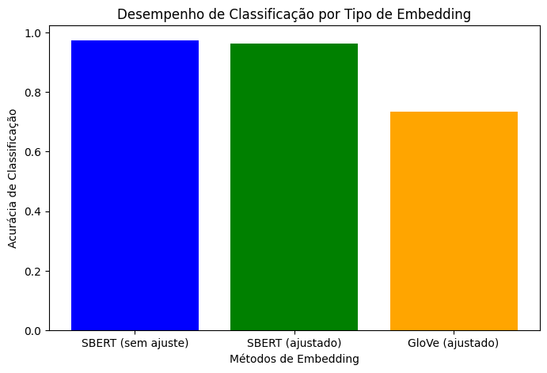

## Projeto de Sistema de Busca com Embeddings Ajustados

Este projeto consiste em um sistema de busca semântica para documentos acadêmicos, utilizando embeddings de texto. O objetivo é avaliar documentos com base na relevância semântica em relação a uma consulta, empregando técnicas de ajuste fino para melhorar a capacidade de distinção e a qualidade das recomendações.

---

### Descrição do Dataset

O dataset é composto por artigos acadêmicos, contendo informações sobre título e resumo de cada artigo. Estes resumos são usados como a representação textual dos documentos e são transformados em embeddings para permitir a busca baseada em similaridade semântica. O dataset contém aproximadamente 10 mil documentos, distribuídos em diversas áreas de conhecimento.

---

### Geração de Embeddings

Para gerar embeddings dos documentos, foi utilizado o modelo pré-treinado SBERT (`all-MiniLM-L6-v2`). Este modelo transforma cada texto em um vetor de alta dimensão. Em seguida, aplicou-se um autoencoder para realizar ajuste fino, reduzindo a dimensionalidade dos embeddings SBERT e refinando a representação vetorial para capturar as características específicas do dataset.

A estrutura do autoencoder inclui uma camada encoder para reduzir a dimensionalidade e uma camada decoder para reconstruir o embedding original. Os principais hiperparâmetros são: dimensão do embedding (`EMBEDDING_DIM=384`), dimensão da camada oculta (`HIDDEN_DIM=128`), taxa de aprendizado (`LEARNING_RATE=0.001`) e número de épocas (`EPOCHS=10`).

---

### Processo de Treinamento e Função de Perda

Durante o treinamento, foi utilizado o erro quadrático médio (MSELoss) como função de perda, que minimiza a diferença entre o embedding original e o embedding reconstruído. Essa função permite que o autoencoder capture características essenciais dos embeddings enquanto ignora ruídos. O uso do erro quadrático médio permite ao autoencoder capturar representações compactas que preservam a semântica relevante dos documentos.

**Função de Perda:**
$$
\text{MSE} = \frac{1}{n} \sum_{i=1}^{n} (x_i - \hat{x}_i)^2
$$

---

### Visualização dos Embeddings

Após o ajuste fino, foi utilizado o t-SNE para projetar os embeddings em 2D e visualizar a organização dos documentos no espaço vetorial.

1. **Embeddings Pré-Treinados SBERT**: A figura abaixo mostra a organização dos documentos usando embeddings SBERT sem ajuste fino. Observa-se alguns agrupamentos iniciais, mas sem uma separação clara entre as categorias.

2. **Embeddings Ajustados pelo Autoencoder**: A figura a seguir exibe os embeddings ajustados. Após o ajuste fino, os clusters apresentam uma organização mais definida, indicando que o autoencoder contribuiu para a distinção entre diferentes temas dos documentos.

A organização dos agrupamentos nos embeddings ajustados sugere que o autoencoder foi capaz de refinar as relações semânticas presentes no dataset, resultando em uma estrutura mais clara e coerente entre os pontos. Isso indica que os embeddings ajustados estão melhor adaptados para capturar nuances semânticas específicas, tornando-os mais adequados para tarefas de busca semântica, onde é importante diferenciar contextos e significados sutis entre documentos.

---

### Resultados dos Testes de Busca

Foram realizados três testes para validar o sistema de busca:

Teste 1 - Consulta que deve retornar 10 resultados: Utilizando uma consulta com aplicação específica em aprendizado profundo no processamento de linguagem natural, o sistema retornou 10 documentos relevantes, abordando temas relacionados a aplicações de deep learning na área de NLP.

Teste 2 - Consulta que deve retornar menos de 10 resultados: Com uma consulta mais generalista sobre instâncias da AWS para modelos de aprendizado de máquina, o sistema retornou uma quantidade menor de documentos, indicando que a busca consegue restringir resultados conforme o foco da consulta.

Teste 3 - Consulta com resultado não óbvio: Usando uma consulta propositalmente ambígua, o sistema retornou resultados variados que não possuem uma conexão direta, sugerindo que o modelo tenta explorar diferentes tópicos para consultas menos claras ou específicas.

---

### Avaliação do Desempenho do Sistema

Para avaliar o desempenho das diferentes abordagens de embeddings, foi usada uma tarefa de classificação proxy com base em categorias de documentos. A métrica escolhida foi a acurácia de classificação, que reflete a capacidade dos embeddings de distinguir documentos em categorias distintas.

1. **SBERT (sem ajuste)**: Apresentou a maior acurácia de classificação entre as abordagens, indicando que os embeddings SBERT pré-treinados capturam características relevantes do dataset. Esse resultado sugere que o modelo SBERT, mesmo sem ajuste fino, é eficaz para representar a semântica dos documentos.

2. **SBERT (ajustado com autoencoder)**: Teve uma acurácia inferior ao SBERT sem ajuste. Esse desempenho indica que o ajuste fino com autoencoder pode ter introduzido uma perda de informação ou um viés específico do dataset que prejudicou a capacidade dos embeddings de generalizar. Isso sugere que, para este dataset, os embeddings SBERT pré-treinados são suficientemente robustos e o ajuste fino não trouxe benefícios.

3. **GloVe (ajustado com autoencoder)**: Apresentou a menor acurácia entre as três abordagens, embora tenha mostrado um desempenho razoável. Esse resultado indica que, apesar do ajuste fino com o autoencoder, os embeddings GloVe não capturam a semântica do dataset com a mesma eficiência dos embeddings SBERT, mesmo sem ajuste.

Esses resultados indicam que o ajuste fino com autoencoder não é vantajoso para todos os tipos de embeddings e datasets. No caso específico deste projeto, o SBERT sem ajuste foi a abordagem mais eficaz para capturar a semântica do dataset, enquanto o ajuste fino não melhorou o desempenho e até levou a uma leve degradação nos resultados.